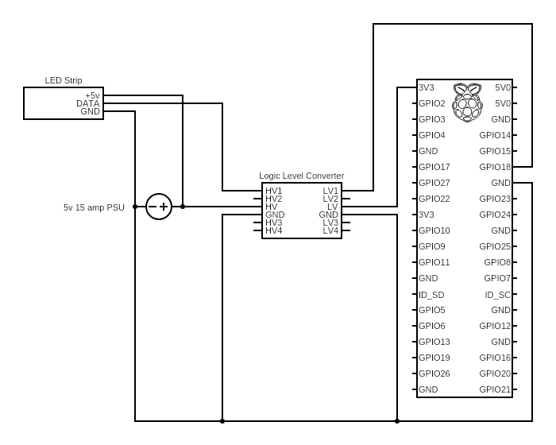

# LED Light Strips

## Overview

Started this project just for a bit of fun, and to spice up my somewhat lackluster desk area. Don't expect the server code to be particularly efficent or secure - I only intend to use it on my LAN and I wrote it to 'just work.' In this repo you'll find the circuit diagram (hopefully correct), server code, and some example scripts (as you'd expect, inside the `/scripts/` folder.)

Before running, use pip to install the following packages:

- `pip3 install Flask gevent rpi_ws281x adafruit-circuitpython-neopixel`

As well as downloading [jscolor](https://jscolor.com/) and adding it to /static/js/

To run the server, just navigate to the root directory and run `sudo python3 DynamicLEDServer.py` and go to the device's local IP from a web browser. (e.g. `10.0.1.63` or '192.168.2.56')

I may make a "tutorial" video at some point if I feel like it, and would explain the repo more thoroughly there.

## Diagram

While you *can* directly plug the power supply and PI output into the LED strip, this just ensures safety.

## Components Used

(I don't officially endorse any of these products, they're just what I'm using.)

- Raspberry PI

- Logic Level Converter [Amazon Link](https://www.amazon.com/gp/product/B07DCVFYJT/ref=ppx_yo_dt_b_asin_title_o04_s02?ie=UTF8&psc=1)

- WS2812B Light Strip [Amazon Link](https://www.amazon.com/gp/product/B018X04ES2/ref=ppx_yo_dt_b_asin_title_o04_s01?ie=UTF8&psc=1)

- 5v 15+ amp Power Supply [Amazon Link](https://www.amazon.com/gp/product/B01LXN7MN3/ref=ppx_yo_dt_b_asin_title_o04_s00?ie=UTF8&psc=1)
